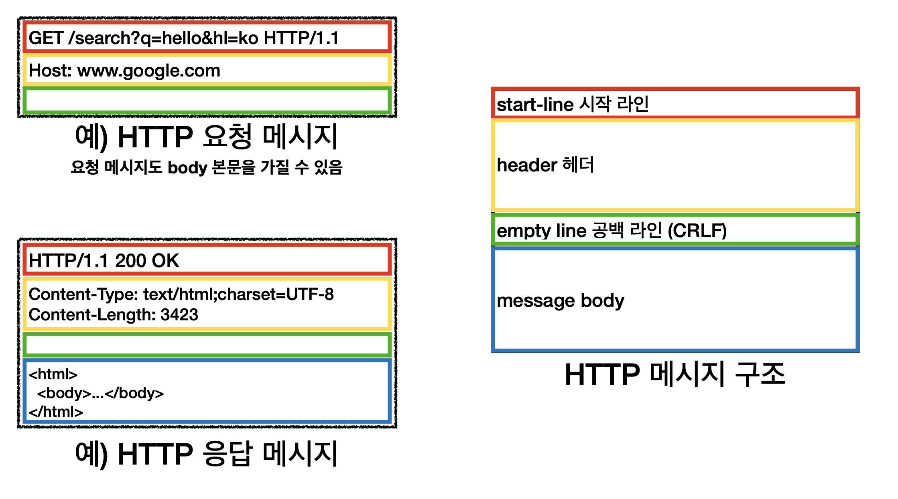

# HTTP (HyperText Transfer Protocol)
* HTML, TEXT , 이미지 , 음성 , 영상 , 파일 ,JSON ,XML 모든 형태 데이터 전송
* 서버간 데이터를 주고 받을 때도 대부분 HTTP 사용
  
### HTTP 역사
  * HTTP 중 현재 **HTTP/1.1**를 가장 많이 사용한다.
    * RFC2068(1997) -> RFC 2616(1999) -> RFC7230 ~ 7235 (2014)
  * HTTP/2 2015년 : 성능 개선
  * HTTP/3 진행중 : TCP 대신 UDP 사용 , 성능개선
* 기반 프로토콜
  * TCP : **HTTP/1.1** , HTTP/2
  * UDP : HTTP/3
  * 현재 HTTP/1.1 주로 사용
    * 2,3 도 사용량 증가
### HTTP 특징
* 클라이언트와 서버 구조 (request , response)
  * 클라이언트는 UI를 그리는데와 사용성에 집중을한다.
  * 서버에서는 비즈니스로직이랑 데이터를 관리하고
  * **위와 같은 구조로 인해 서로 독립적으로 집중이 가능하다**
* 클라이언트 서버에 요청을 보내고 응답을 대기한다.
* 서버가 요청에 대한 결과를 만들어서 응답함 
### 무상태 프로토콜 || 스테이리스 (Stateless)
* 서버가 클라이언트의 상태를 보존하지 않는다.
  * 상태유지 : Stateful
    * 상태가 유지하게 되면 서버가 클라이언트 상태를 보존하고 있어서 다양한 서버가 클라이언트에 요청을 처리하지 못하고 **반드시 처음 받은 서버가 결과를 처리**해야 정상적인 응답을 처리 할 수 있다.
      * 클라이언트에 상태를 유지한다. 처음 접한 서버가 클라이언트에 CONTEXT 문맥을 가지고 계속 유지하게 된다.
      * 중간에 서버가 장애가 나면 요청을 처음부터 다시 처리해야한다.
  * 무상태 : Stateless
    * 상태를 계속 유지하지 않아서 중간에 서버가 변경이 되어도 필요한 데이터를 가지고 있기에 클라이언트 요청이 증가해도 서버를 증가 시킬수있다.
    * **무상태는 응답서버를 쉽게 바꿀수 있다 -> 서버 증설 용이**
  * **모든것을 무상태로 설계할수 없는 경우도 있다.**
    * 로그인 : 로그인한 사용자의 경우 로그인 상태를 서버에 유지
    * 일반적으로 브라우저 쿠키와 서버 세션등 사용해서 상태 유지
    * **상태 유지는 최소한만 사용**
### 비연결성
* TCP / IP 연결은 기본적으로 연결을 유지한다.
* 연결을 유지하는 모델
  * 서버는 연결을 계속유지, 서버 자원을 소모
  * 단점 : 클라이언트가 사용을 않하고 있어도 서버는 연결을 계속 유지하고 있어야함
* 연결을 유지하지 않는 모델
  * 요청 응답이 이루어지면 연결을 바로 끊는다.
  * **장점 : 서버는 연결유지하고 있지 않아도 된다. 최소한의 자원만 사용 가능**
* HTTP는 기본이 연결을 유지하지않는 모델이다.
  * 일반적으로 응답은 초단위 이하에 매우 빠른 응답이고 동시에 수천개에 요청이 오지않기에 서버 자원을 효율적으로 사용할 수 있다.
#### 비연결성에 한계 및 극복
* TCP/IP 연결을 새로 맺어야 함 - 3 way handshake 시간 추가
* 웹 브라우저로 사이트를 요청하면 HTML 뿐 아니라 다른 리소스까지 함께 다운로드
* 지금은 HTTP 지속연결 (Persistent Connections)로 문제 해결
* HTTP2 HTTP3에서는 더 많은 최적화를 이루고 있다.
#### 스테이리스를 기억하자
* 서버 개발자들이 어려워하는 업무
* 어떻게든 Stateless 하게 설계를 해야 된다.
  * 같은 시간에 딱 맞추어 발생하는 대용량 트래픽
    1.선착순 이벤트 , 명절 KTX 예약, 학과 수업등 -> 수만명 동시 요청
### HTTP 메시지

* 요청메시지 **시작라인**
* start-line = request-lin(요청) / status-line(응답)
  * request-line : method로 시작 / 요청 타켓(path) HTTP버전이 들어간다.
  * status-line : HTTP-version / status-code(상태코드 : ...200) response-pharse (OK 사람이 읽을 상태코드)
* HTTP 헤더 용도
  * HTTP 전송에 필요한 모든 부가정보
  * 예) 메시지 바디내용,크기 압축 , 인증,요청 클라이언트 정보,서버 애플리케이션 정보, 캐시관리정보...
  * 필요시 임의의 헤더 추가도 가능
* 메시지 바디
  * 실제 전송할 데이터
  * 예) HTML문서 , 이미지 , 영상 JSON ,byte로 표현할 수 있는 모든 데이터가 가능합니다.